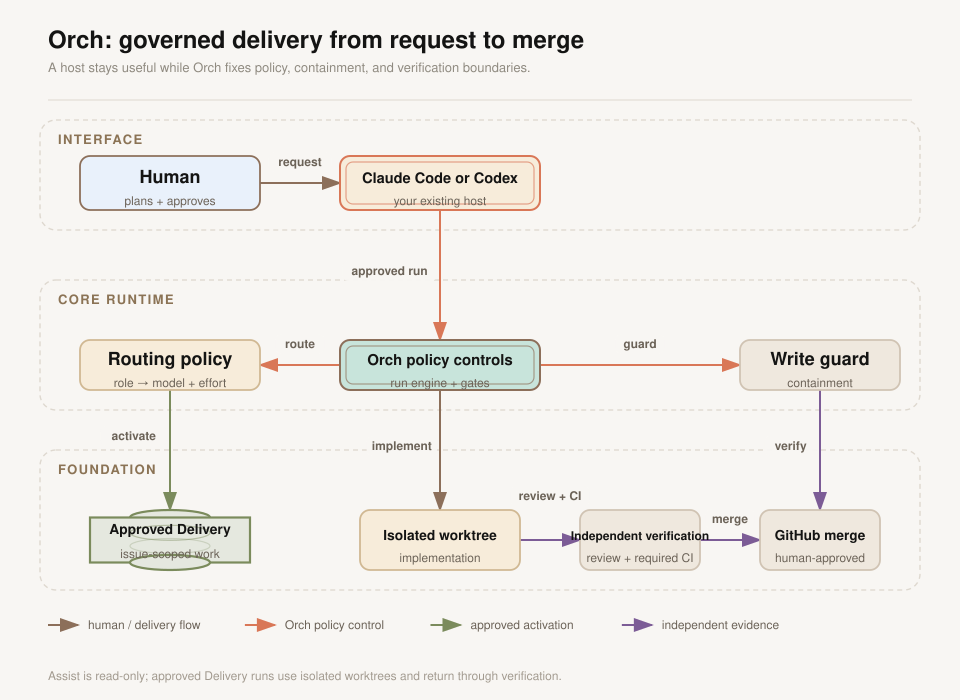

# Orch

*Your coding agent doesn't choose its own model, and Orch puts mechanical bounds on what it may write.*

<p align="center">
  
  
  
  <br/>
  
  
</p>

---

Left to itself, a coding agent picks its own model for every task, and it can write to any file it can reach. That's fine until the model is wrong for the job — too expensive for something trivial, or too weak for something that actually matters — or until a change lands somewhere you didn't intend it to.

Orch sits underneath the CLI you already use (Claude Code or Codex CLI) and takes over those two decisions. By default it puts the repository in **Assist**: a mechanical, read-only mode where the agent can look around, search, explain and plan, but a write to a file git does not ignore is refused before it happens. When you approve a plan, Orch enters **Delivery**: each task becomes a GitHub issue with its own isolated git worktree, gets implemented there, is reviewed by a separate agent dispatch, runs CI, and is merged only after you approve it. Which model handles which job is not the agent's call either — you route it, per role, to an exact model version and effort level.

The payoff: cheap, fast models handle read-only exploration and mechanical work, a frontier model gets spent only where the plan calls for it, and every change that lands is auditable and gated by a human at the one step that matters — the merge.

<br>

<p align="center">
  
</p>

---

## What you actually get

- **Read-only by default.** Assist mode mechanically denies every write to a file git does not ignore — not a convention the agent is asked to honor, but a decision `orch guard` makes before the write happens.
- **You route the model, not the agent.** Six roles — architect, scout, implementer, specialist, reviewer, and a cheaper review downgrade — each pin an exact model version and effort level you choose, so a cheap model handles read-only work and a frontier model is spent only where the plan calls for it.
- **Every issue gets its own worktree.** Delivery work happens on its own branch, in its own isolated git worktree, never in your primary checkout.
- **A separate dispatch reviews the work.** The pull request is reviewed in a dispatch separate from the one that wrote it — never the same run marking its own homework.
- **You hold the merge gate.** Nothing lands on your default branch until you approve it, and the merge fails closed if the pull request moved after your approval.
- **Every issue and PR carries an audit record.** The exact model, the effort, how the host actually delivered that effort, and the routing rationale are recorded on the issue and mirrored onto its pull request.
- **Works with the CLI you already use.** Orch works with both [Claude Code](adapters/claude/README.md) and [Codex CLI](adapters/codex/README.md), so you keep working in the agent you already have.

---

## How it works

**Two modes.** A repository running Orch is in exactly one of two states. **Assist** is the default and is read-only: the agent can read anything, search, explain and plan, but a write to a file git does not ignore is refused. **Delivery** is entered only for a plan you have read and approved. Each task in that plan becomes a GitHub issue, a branch, and its own git worktree; the work happens there, lands as a pull request, is reviewed by a separate agent, runs CI, and waits for you to approve the merge. When every task is merged or abandoned, the run's last step puts the repository back in Assist.

**Six roles.** Delivery work is split across roles, and you pin each one to an exact model version and reasoning-effort level:

| Role | What it does |
|---|---|
| Architect | Plans the work, drives the pipeline, talks to you — your strongest model |
| Scout | Read-only exploration and fact-finding — cheap and fast |
| Implementer | Writes the code inside the issue's worktree |
| Specialist | Takes the issues routing marks risky or unusually difficult |
| Reviewer | Reviews the pull request in a separate dispatch from the one that wrote it |
| Review downgrade | A cheaper reviewer, allowed only when the plan affirms all four of mechanical, low-risk, fully specified, unsurprising |

Which role gets an issue is derived from the issue's own facts by a deterministic table, not chosen by the model that will run it. The reviewer is always a separate dispatch and never the session that wrote the code, but under the shipped defaults it is often not a different model: on Claude every role runs `claude-opus-5`, so both sides always match; on Codex the specialist and the reviewer share `gpt-5.6-sol` while the implementer runs `gpt-5.6-terra` and the downgraded reviewer `gpt-5.6-sol`, so a specialist run has the same model on both sides but a downgraded review pairs different ones. Effort is where the hosts diverge: a specialist run's reviewer matches the specialist's effort on Claude (high on both) but not on Codex (max executor, xhigh reviewer), and a downgraded review drops effort below the implementer's on Codex (max to high) but not on Claude (medium on both).

**The guard.** None of the above is an instruction the agent is asked to honor. Both host adapters wire the CLI's pre-write hook to `orch guard`, a subcommand of the same binary, which is consulted before the agent writes a file and answers allow or deny. In Assist it denies every write to a file git does not ignore. In Delivery it allows a write only inside a worktree registered to the running plan, on that worktree's registered branch, in a phase where writing is allowed. Git internals are never writable, and neither is the orchestrator state your session is running against. It fails closed: anything it cannot establish is a denial. What it enforces is containment — it cannot tell which role is writing, and a file written by a shell command never reaches it at all (see [Known issues](#known-issues-and-limitations)).

Concretely, asking for a change goes like this:

1. You describe what you want. The Architect plans it in Assist and shows you the plan: one issue per task, each carrying the model, effort and reviewer it will get and why.
2. You approve it or send it back. Approving is what enters Delivery.
3. Each issue gets a branch and a worktree. An implementer or a specialist does the work there and pushes.
4. A reviewer reviews the pull request. CI runs.
5. You approve the merge, and it runs against GitHub pinned to the commit that approval names — it fails closed if the pull request moved after that.

The full product definition lives in [ORCH-PRD.md](ORCH-PRD.md).

## Status

Early software. What can be stated as fact: 15 tagged releases, v0.1.0 through v0.6.0, and every pull request merged since PR #40 carries an Orch audit record in its body — apart from the configuration deliveries, which `orch configure` writes in its own body format. Since PR #40, this repository has been built through the pipeline described above: a plan gate, an isolated worktree per issue, a review dispatched separately from the work, CI, and a merge that fails closed unless it carries an approval pinned to the commit `merge-report` recorded.

All of that evidence comes from one repository: this one.

## Install

### Have your agent do it

Paste this into a Claude Code or Codex CLI session, started anywhere.
It does not assume you have cloned this repository.

```text
Install the Orch development orchestrator (https://github.com/kninetimmy/orch)
on this machine. Work in a scratch directory, not in one of my projects.

1. Detect my OS and run the matching installer:
     - Linux or macOS: download
       https://raw.githubusercontent.com/kninetimmy/orch/main/install.sh
       and run it with `sh install.sh`
     - Windows: download
       https://raw.githubusercontent.com/kninetimmy/orch/main/install.ps1
       and run it with
       `powershell -ExecutionPolicy Bypass -File .\install.ps1`
   The installer downloads the release binary for this OS and architecture
   and verifies its SHA-256 against the release's published SHA256SUMS
   before installing anything. If that verification fails, STOP and report
   the failure to me. Do not retry with verification skipped, do not fetch
   the binary another way, and never install an unverified binary.

2. Confirm that `orch` resolves on PATH and that `orch status` prints a
   release version on its first line — a line beginning `orch:` and giving
   a release tag such as v0.6.0. Run it from anywhere: outside an
   initialized repository it prints that version line first and then exits
   non-zero saying the repository is not initialized, which is expected
   here. On Windows the installer adds its install directory to my user
   PATH and a new terminal is needed to pick that up: if `orch` is not
   found, ask me to open a new terminal rather than guessing or editing
   PATH yourself.

3. Install the plugin for the host you are running in. Use exactly these
   commands:
     - Claude Code:
         claude plugin marketplace add kninetimmy/orch
         claude plugin install orch-claude@orch
     - Codex CLI:
         codex plugin marketplace add kninetimmy/orch
         codex plugin add orch@orch

4. Codex CLI only. Skip this entire step on Claude Code, which needs no
   clone:
   a. Codex plugins cannot ship agent definitions, so clone the repository
      into a temporary directory outside my projects:
        git clone --depth 1 https://github.com/kninetimmy/orch.git <tmp>/orch
   b. Copy these five files from <tmp>/orch/adapters/codex/agents/ into
      that repository's own .codex/agents/:
        orch-scout.toml
        orch-implementer.toml
        orch-specialist.toml
        orch-reviewer.toml
        orch-reviewer-safe.toml
   c. Delete <tmp>/orch afterwards. Nothing else from the clone is needed.
   d. Add both of these stanzas to ~/.codex/config.toml, leaving any
      existing content in place:
        [tools.experimental_request_user_input]

        [features]
        default_mode_request_user_input = true
   e. Tell me that Codex CLI shows a one-time trust prompt for the
      plugin's bundled hooks, that approving it is an action only I can
      take, and that the hooks do not run at all until I approve it. Do
      not report the install as finished as though the hooks were live.

5. Run `orch doctor` and report its full output to me, including every
   note and every failing check. When run outside an initialized
   repository it reports the git-repository and configuration checks as
   failures; say so rather than hiding it.

6. Tell me to restart this CLI before relying on any of it, and to treat
   the hooks as not yet running until I have. Do not assume a plugin
   installed mid-session is live in this session. The tell that it took
   is an Orch block at session start inside an initialized repository.

7. Finish by telling me all three of these: `orch init` has to be run once
   inside every repository I want orchestrated; Orch does nothing at all
   in a repository that has not been initialized; and `orch init` does not
   write the configuration into my working tree — it opens a pull request
   carrying .orchestrator/config.toml for me to review and merge.
```

### Then initialize each repository you want orchestrated

Installing the binary and the plugin sets up the machine. It does not
touch any repository. In a repository that has not been initialized,
Orch does nothing.

Run `orch init` from the root of each repository you want orchestrated.
It detects your environment (hosts, git, `gh`, memhub), interviews you
about which hosts to enable and which models each role should use —
every question has a default — and then bootstraps itself through its
own pipeline: `.orchestrator/config.toml` arrives as a pull request you
review and merge, not as a silent write to your working tree.

Delivery additionally needs `git` and the
[GitHub CLI](https://cli.github.com/) (`gh`) authenticated against the
repository's remote. Assist works without a remote.

Each adapter's README carries its host's exact install order and its
own known limitations, worth reading once for the host you use:
[Claude Code](adapters/claude/README.md#install-order),
[Codex CLI](adapters/codex/README.md#install-order).

<details>
<summary><b>Install it yourself</b> — scripts, plugins, manual download, source builds</summary>

**Quick install (script).** Both scripts download the release binary for
your OS and architecture, verify its SHA-256 against the release's
`SHA256SUMS` **before** installing, and fail closed on any mismatch.

Linux / macOS — installs to `~/.local/bin` (override with
`ORCH_INSTALL_DIR`); pin a version with `ORCH_VERSION=v0.6.0`:

```sh
curl -fsSLO https://raw.githubusercontent.com/kninetimmy/orch/main/install.sh
# inspect it, then:
sh install.sh
```

Windows (PowerShell) — installs to `%LOCALAPPDATA%\Programs\orch` and
appends that directory to your user `PATH`; skip the `PATH` change with
`-NoPathUpdate`, pin a version with `-Version v0.6.0`:

```powershell
iwr https://raw.githubusercontent.com/kninetimmy/orch/main/install.ps1 -OutFile install.ps1
# inspect it, then:
powershell -ExecutionPolicy Bypass -File .\install.ps1
```

**Plugin install (two commands per host).** With the binary on `PATH`,
each host installs its adapter from this repository's marketplace
manifest:

```sh
# Claude Code
claude plugin marketplace add kninetimmy/orch
claude plugin install orch-claude@orch

# Codex CLI
codex plugin marketplace add kninetimmy/orch
codex plugin add orch@orch
```

One manifest (`.claude-plugin/marketplace.json`) serves both hosts, and
the other host's entry may show up in your listing too — install yours
by its exact name: `orch-claude` on Claude Code, `orch` on Codex CLI.
Then follow the host-specific steps in the adapter
READMEs — [Claude Code](adapters/claude/README.md#install-order),
[Codex CLI](adapters/codex/README.md#install-order). Codex CLI needs
three more things the plugin install cannot do for you: the one-time
hook trust approval, the five agent TOMLs copied into `.codex/agents/`
(or rendered there with `orch render-agents`), and the two
`request_user_input` stanzas in `~/.codex/config.toml`.

**Plugin upgrade (existing installs).** Do not repeat the first-install
commands above. Upgrade the configured host's marketplace and adapter:

```sh
# Claude Code
claude plugin marketplace update orch
claude plugin update orch-claude@orch

# Codex CLI
codex plugin marketplace upgrade orch
```

Restart Claude Code or Codex CLI after upgrading its adapter so the new
hooks and skills are loaded.

**Manual download.** Take the static binary for your OS and
architecture from
[GitHub Releases](https://github.com/kninetimmy/orch/releases)
(`orch_<os>_<arch>`; Windows assets end in `.exe`), then verify its
SHA-256 against the `SHA256SUMS` file published with that release
**before running it**:

```sh
# Linux / macOS
sha256sum --check --ignore-missing SHA256SUMS

# Windows (PowerShell): compare against the matching SHA256SUMS line
(Get-FileHash orch_windows_amd64.exe -Algorithm SHA256).Hash
```

Rename it to `orch` (or `orch.exe`) and put it on your `PATH`. `orch
status` and `orch doctor` each print the binary's release version on
their first line.

**Build from source.** Go 1.26+; source builds report version `dev`:

```sh
git clone https://github.com/kninetimmy/orch.git
cd orch
go build ./cmd/orch        # produces ./orch (orch.exe on Windows)
```

or install straight onto your `PATH`:

```sh
go install github.com/kninetimmy/orch/cmd/orch@latest
```

</details>

## Day to day

`orch help` lists every command, human and plumbing, in one place:

```text
usage: orch <command>

commands:
  init             Interview and bootstrap this repository
  status           Show mode and configuration summary
  doctor           Check environment and configuration health
  configure        Interview and deliver committed configuration changes
  configure-local  Interview and apply machine-local overrides
  resume           Reconcile an interrupted Delivery run against GitHub and continue
  abort            Stop dispatch and return to Assist
  metrics          Show local metrics
  render-agents    Render the five Codex agent TOMLs from configuration into .codex/agents/
  run              Adapter plumbing: Delivery run verbs (JSON stdin/stdout; not a human command)
  guard            Adapter plumbing: pre-write enforcement for host hooks (not a human command)
  hook             Adapter plumbing: host lifecycle-event verbs (not a human command)
```

The last three rows — `run`, `guard`, `hook` — are what the host
adapters call for you; you never invoke them by hand.

On Claude Code the three interviews also have slash commands:
`/orch:init`, `/orch:configure`, `/orch:configure-local`.

## Settings — what you can tune

Configuration lives in two TOML files under `.orchestrator/`:

- **`config.toml`** — committed to git, shared by everyone working on
  the repository. Changed with `orch configure`, which delivers the
  edit as a reviewable pull request.
- **`config.local.toml`** — machine-local and gitignored, for personal
  preferences. Changed with `orch configure-local`, applied directly.

The split is a closed table over every key in the schema, not a
convention: policy keys can only live in the committed file, so a
local override can never weaken a shared workflow rule.

| Setting | Values (default) | Local override? |
|---|---|---|
| `hosts.claude` / `hosts.codex` | enable a host by giving it a role table | no (committed) |
| `hosts.<host>.roles.<role>.model` | exact model version string | yes |
| `hosts.<host>.roles.<role>.effort` | `low` `medium` `high` `xhigh` `max` (+ `ultra` on codex) | yes |
| `concurrency.max_subagents` | integer ≥ 1 (`3`) | yes |
| `metrics.enabled` | `true` / `false` (`false` when omitted) | yes |
| `merge.strategy` | `squash` `rebase` `merge-commit` (`squash`) | no (committed) |
| `memhub.mode` | `required` `best-effort` `off` (no default — you choose) | no (committed) |

Every enabled host carries the same six roles: `architect`, `scout`,
`implementer`, `specialist`, `reviewer`, and `review_downgrade` (the
cheaper reviewer Orch may use only when the plan affirms all four of
mechanical, low-risk, fully specified and unsurprising — claims routing
takes at face value rather than checks). Each role
names one model string; the interview offers exact versions rather
than tier aliases, and whatever string is configured is the one that
lands in the audit record, so the record says what ran instead of what
tier it belonged to. The defaults `orch init` offers:

| Role | Claude Code | Codex |
|---|---|---|
| Architect | `claude-opus-5` / high | `gpt-5.6-sol` / xhigh |
| Scout | `claude-opus-5` / low | `gpt-5.6-luna` / max |
| Implementer | `claude-opus-5` / medium | `gpt-5.6-terra` / max |
| Specialist | `claude-opus-5` / high | `gpt-5.6-sol` / max |
| Reviewer | `claude-opus-5` / high | `gpt-5.6-sol` / xhigh |
| Review downgrade | `claude-opus-5` / medium | `gpt-5.6-sol` / high |

Typical tuning: point a role at a bigger or smaller model on one
machine with `configure-local` (run the Architect on a frontier model
only where you have the subscription), raise `max_subagents` on a
machine that can take it, or turn on local metrics while experimenting.
`orch status` reports how many overrides are in effect and `orch
doctor` names the exact keys they set, so a machine-local change is
never invisible.

## Memhub integration

memhub is an external, optional, local-first per-repository
project-memory CLI. Orch talks to it when it is present but neither
requires it nor ships it: set `memhub.mode` to `off` and Orch never
looks for it.

`memhub.mode` is committed, in `config.toml`, and has three values:

- **`off`** — memhub is skipped entirely: no probes, no doctor checks.
- **`best-effort`** — memhub's health and recall are probed and
  reported, but a failure never blocks anything.
- **`required`** — Delivery planning fails closed if either probe
  fails: the plan gate refuses to activate the run.

Both the plan gate and `orch doctor` run the same two-step check: a
`memhub status` health probe, then — only if that succeeds — a `memhub
recall` against a fixed canary query, so a wedged retrieval path that
still exits 0 is caught rather than trusted. `orch doctor` is
mode-aware: `off` prints a skip note, `best-effort` reports the result
as a note without failing, and `required` fails the check outright.

Orch's own memhub client is read-only: it probes and recalls, and
never writes, renders, reindexes or syncs. Writes are the Architect's
alone, and that boundary is stated in the skills rather than enforced
mechanically — a subagent carrying a shell can reach the memhub CLI
too. Anything a subagent wants remembered comes back in its report.
Every memhub command runs with the primary checkout as its working
directory, never inside a per-issue worktree, because worktrees never
receive a copy of the memhub database.

## Known issues and limitations

<details>
<summary>What will bite you today — symptom, cause, workaround</summary>

**Writes made through the shell are not guarded.** The pre-write hook
covers Claude Code's `Write`, `Edit`, `MultiEdit` and `NotebookEdit`
and Codex CLI's `apply_patch`. A file written by a shell command —
`echo > file`, a script, a `git checkout` — never reaches `orch
guard`, so neither Assist's read-only rule nor Delivery's worktree
containment applies to it. Symptom: an agent modifies your working
tree in Assist and nothing denies it. Workaround: the host's own
permission and approval prompts on shell commands are the only
backstop; leave them on.

**The guard cannot tell one role from another.** `orch guard` has a
`--role` flag that would make a role mechanically read-only. Neither
adapter passes it: host hooks are plugin-global rather than scoped per
dispatched agent, so both `hooks.json` files run the bare command.
Inside a worktree the guard treats as writable, a scout or a
reviewer is no more restricted than the implementer. On Claude Code
the `orch-scout` subagent's tool whitelist does close its write
surface — it carries no `Bash` — but `orch-reviewer` and
`orch-reviewer-safe` both carry `Bash`, so their read-only discipline
rests on their instructions. Codex agent definitions carry no tool
whitelist at all.

**An `orch run` verb invoked from inside a Delivery worktree reports
Assist and names the wrong fix.** Every `orch` command resolves
`.orchestrator/` from its own working directory. A Delivery worktree
carries the committed `.orchestrator/config.toml` but no
`state.json` — that file is machine-local and gitignored — so `orch
status` run there prints `mode: assist` while a run is active, and a
lifecycle verb fails with ``no delivery run is active; run `orch run
activate` to enter Delivery first``. Activating a second run is exactly
the wrong move. Workaround: run every `orch run` verb with the primary
checkout as the working directory.

**A missing binary fails open, not closed.** Both adapters' hooks are
bare `orch guard <host>` commands. If `orch` does not resolve on
`PATH`, the hook exits with a shell "command not found", which both
hook protocols treat as non-blocking: the guard silently stops
enforcing and the session-start context stops being injected. No
error, no denial. On Codex CLI the same is true while the plugin's
one-time hook trust approval is outstanding — until you approve it,
the bundled hooks do not run at all. Symptom: no denial where you
expected one, and no Orch block at session start. Workaround: install
the binary before the plugin, approve the trust prompt, and run `orch
doctor`; a missing session-start block is the visible tell.

**`claude plugin install` on a host that already has the adapter
changes nothing and leaves the old version running.** Claude Code
treats an install of a plugin it already carries as satisfied: `claude
plugin install orch-claude@orch` exits 0 reporting `Plugin
"orch-claude@orch" is already installed`, even when `claude plugin
marketplace update orch` has just fetched a newer adapter into the
plugin cache. Installing and upgrading are two different commands, and
only `claude plugin update orch-claude@orch` replaces the active
version (it says `Restart to apply changes` when it does). Symptom:
following the agent install prompt's step 3 on a machine that already
has Orch reports success while the previous adapter goes on running.
Workaround: on an existing install use the upgrade commands above, not
the first-install ones; `orch doctor` names the installed and the
expected adapter version when they diverge.

**`orch doctor` fails on a machine that lacks a configured host's
command-line tool.** Doctor checks every host the committed
configuration names, and fails when that host's CLI is missing from
`PATH`, when its plugin listing cannot be read, or when its adapter is
in any of six states — absent, listed more than once, disabled,
reporting no version at all, reporting a different version, or, on
Codex, marked not installed. Host enablement is a committed-only key
— the Settings table above marks `hosts.claude` / `hosts.codex` as
`no (committed)` — so machine-local configuration cannot switch a
host off for one machine. Symptom: a repository configured for both
hosts reports a failing doctor on every machine that has only one of
them installed. Workaround: enable only the hosts every machine
working on the repository will have, or install the missing CLI on
that machine. There is no override for this, by design: the check
exists so an adapter that is absent or out of date is reported rather
than trusted.

**Codex `workspace-write` sandbox mode on Windows fails every agent
write where the sandbox helper infrastructure is absent.** Observed
live: every `apply_patch` fails with `orchestrator_helper_launch_failed`
before any mutation, which stops Delivery execution cold. Workaround:
confirm the sandbox actually works on that machine before setting
`sandbox_mode = "workspace-write"` there.

**Claude Code has no per-subagent effort parameter.** The routed
effort reaches a Claude subagent as a cue in its prompt, not as a host
parameter, so the effort in the audit record is what was routed rather
than something the host applied. The record says so outright, as
`Effort delivery: prompt-cue`. Codex pins effort in the installed
agent TOML and the host enforces it.

**A model override does not reach a dispatched agent by itself, on
either host.** Neither host can override a model per spawn, so the
routed selection has to match an installed agent definition. On Codex
that means the five agent TOMLs are a separate install step the
marketplace install does not perform — you copy them or run `orch
render-agents` — and after you change `hosts.codex.roles`, the
installed TOMLs still pin the old model until you re-render. That much
the binary now catches: `orch doctor` and Codex plan activation both
compare the rendered definitions against the effective configuration
and fail closed naming `orch render-agents`, so activation refuses
rather than dispatching agents pinned to a stale model. On Claude Code
`orch doctor` reports the same comparison but repairs nothing: it
resolves the installed plugin root from `claude plugin list --json`,
reads the model each of the five installed agent definitions pins in
its frontmatter, and fails as `claude agent definitions`, naming every
role whose `hosts.claude.roles` model differs together with both
models — and failing too when those definitions cannot be read at all.
There is no Claude equivalent of `orch render-agents` to run
afterwards: you update the installed plugin or change the configured
model. Claude plan activation does not gate on this, either. The
Architect's skill still instructs it to compare the routed model
against the installed agent's frontmatter and, on a mismatch, to stop
and tell you rather than spawn a different model — so inside a run,
that stop still rests on the Architect following an instruction, not
on a check the engine performs. Either way, changing a role's model —
which the Settings section above recommends as ordinary tuning — is
not finished until the installed agent definitions carry it too.

**A Codex CLI upgrade that adds a new `apply_patch` directive causes
denials until `orch` catches up.** The guard's envelope parser treats
any `*** ` directive line it does not recognize as a malformed
envelope and denies the write. That is deliberate — an unparsed write
must never be allowed — but it means a host upgrade can produce
spurious denials. Workaround: update `orch`.

**The merge gate cannot tell a human's approval from an agent's.** The
engine requires an approval carrying the exact literal `approve-merge`,
pinned to the pull request and head commit `merge-report` recorded, and
`gh pr merge --match-head-commit` refuses if that commit is no longer
the head — so a stale or swapped merge fails closed. What none of that
establishes is who produced the approval: the agent assembles that JSON
itself, and `internal/run/merge.go` says so outright ("the engine
cannot verify a human, so this recorded string is the proof one
approved this specific merge"). Symptom: the audit trail's approval is
the agent's assertion that you approved. Workaround: the merge runs
through `gh` against GitHub, so GitHub-side branch protection is the
one control on this path that does not depend on the agent.

**A crashed run leaves the Delivery lock held; there is no automatic
takeover.** `.orchestrator/delivery.lock` is created with `O_EXCL` and
Orch never steals it on a staleness guess. Symptom: the next run
refuses to start, and `orch doctor` notes that the acquiring process
is no longer running. Workaround: `orch resume` to reconcile and
continue, or `orch abort` to end it.

</details>

## Fixed

<details>
<summary>Defects already corrected, newest first</summary>

Everything here is merged on `main` and shipped in v0.6.0, the latest
tagged release.

- `orch doctor` now checks each configured host's installed Orch
  adapter and fails when it is absent, listed more than once, disabled,
  reporting no version at all, at a different version from the one this
  build ships, or, on Codex, marked not installed, naming the expected
  version and, whenever there is an installed one to name, the
  installed version too — an adapter that is absent or reports no
  version has none to name, so those failures report the expected
  version alone; before, an adapter left behind by a binary-only
  upgrade kept running while doctor reported the host healthy —
  [#167](https://github.com/kninetimmy/orch/pull/167)
- `orch doctor` and Codex plan activation now compare the rendered
  agent definitions in `.codex/agents/` against the current build and
  the effective role configuration, and fail closed naming `orch
  render-agents`; before, definitions rendered from an older
  configuration went on being dispatched with nothing reporting them
  stale —
  [#166](https://github.com/kninetimmy/orch/pull/166)
- Every reviewer agent definition on both hosts — the standard
  reviewer and the safe review downgrade alike — now states that a
  `request-changes` verdict is not confined to findings that block an
  acceptance criterion: a required test that fails, a security boundary
  the change weakens, and any defect of comparable severity are each
  grounds on their own, even when no acceptance criterion names the
  area they sit in; before, Claude Code's two reviewers closed the set
  at exactly two grounds — a finding blocking a criterion, or a
  criterion itself wrong — while Codex's two named the wrong-criterion
  ground without ever saying what else could drive request-changes, so
  on neither host did a required test failing outside every criterion's
  wording have to block the review —
  [#159](https://github.com/kninetimmy/orch/pull/159)
- `orch run review` now refuses, before any mutation, a review that
  does not carry exactly one judgment per acceptance criterion the
  issue holds, and a criterion judged wrong blocks the issue for you as
  part of recording that review; before, a review could approve without
  saying anything about an individual criterion, and a criterion that
  was itself wrong reached you only if the Architect read the paragraph
  and made a second call by hand —
  [#158](https://github.com/kninetimmy/orch/pull/158)
- Codex usage capture now depends only on the rollout that actually
  identifies as the dispatched child, so an unrelated neighbour in the
  sessions tree — a zero-byte file caught mid-creation, one with no
  session metadata, an unparseable first line, or a shape written by
  another Codex version — no longer reports usage unavailable for every
  child in the run; a rollout that does match is still fully validated
  and two matching rollouts still fail closed —
  [#148](https://github.com/kninetimmy/orch/pull/148)
- Claude Code's two reviewer agents now report every finding they make,
  low-severity and uncertain ones included, each carrying a severity
  and a confidence, and decide the verdict afterwards as a separate
  judgment, so a nit stays in the report without by itself costing
  another review cycle; before, neither agent said whether a minor or
  uncertain finding belonged in the report at all, nor that the verdict
  was a judgment made after the findings were listed —
  [#117](https://github.com/kninetimmy/orch/pull/117)
- A verification entry whose text describes the branch as a whole is
  given its `branch-scope:` name prefix at `pr-open`, where the name is
  first chosen; before, a prefix added on a later review cycle appended
  a second entry instead of replacing the original, leaving the stale
  unprefixed one in the audit record permanently —
  [#113](https://github.com/kninetimmy/orch/pull/113)
- `.gitattributes` gained the rule that checks `.gitignore` out with LF
  on every platform; before, a Windows checkout could get CRLF line
  endings in that file, which is what feeds the empty-pattern hazard
  the next entry describes —
  [#110](https://github.com/kninetimmy/orch/pull/110)
- Worktree containment no longer fails open on a `.gitignore` whose
  blank line survives as an empty pattern — a CRLF blank line, or a
  whitespace-only line under LF — because `RequireIgnored` now queries
  two structurally dissimilar child probe paths and requires both to
  come back ignored, instead of a bare trailing-slash directory query,
  and an empty pattern can never match a non-empty basename —
  [#106](https://github.com/kninetimmy/orch/pull/106)
- The metrics ignore line in `.gitignore` is now proposed
  unconditionally instead of only when metrics is enabled, closing a
  trap where turning metrics on before that line existed could leave
  metrics output un-ignored; `orch configure-local` and `orch doctor`
  now fail closed, naming the missing line, when metrics is enabled
  without it —
  [#107](https://github.com/kninetimmy/orch/pull/107)
- Both adapters stopped claiming that per-agent tool whitelists make
  every read-only role unable to write; the shipped prose now matches
  what the guard actually enforces —
  [#90](https://github.com/kninetimmy/orch/pull/90)
- After two or more escalations on one issue, the skills resolve the
  routing in force from the most recent escalation instead of an
  unqualified one —
  [#84](https://github.com/kninetimmy/orch/pull/84)
- A rerouted issue's agent definition is checked against the model it
  was rerouted to, not the one it was dispatched with —
  [#76](https://github.com/kninetimmy/orch/pull/76)
- A review submitted after an escalation is no longer rejected as a
  reviewer mismatch: the skills echo the reviewer currently in force —
  [#71](https://github.com/kninetimmy/orch/pull/71)
- Claude spawns stopped passing a coarse tier alias as the model,
  which could never express an exact routed version; a spawn now
  matches the installed agent's frontmatter or stops —
  [#70](https://github.com/kninetimmy/orch/pull/70)
- Claude Code gained an `orch-reviewer-safe` agent, so a routed
  reviewer downgrade dispatches the reviewer the audit record names —
  [#66](https://github.com/kninetimmy/orch/pull/66)
- Verification entries carry the commit they were gathered at, so
  evidence from an earlier head is distinguishable from evidence at
  the head that merges —
  [#62](https://github.com/kninetimmy/orch/pull/62)
- A review summary gets a 6000-character allowance of its own instead
  of the 2000 that cut a real reviewer's findings mid-criterion, and
  evidence re-run on a fix commit can now reach the audit record —
  [#61](https://github.com/kninetimmy/orch/pull/61)
- A requested-changes cycle no longer sends the issue back through
  `pr-open`, and the skills' stdin form works under PowerShell —
  [#58](https://github.com/kninetimmy/orch/pull/58)
- A pull request with no required checks reports `no-checks` instead
  of erroring on an empty response from `gh pr checks --required` —
  [#44](https://github.com/kninetimmy/orch/pull/44)
- On Windows, a just-exited process no longer probes as still running,
  so `orch doctor`'s dead-acquirer note can fire at all —
  [#7](https://github.com/kninetimmy/orch/pull/7)

</details>

---

## Under the hood

This section is for contributors and the curious; none of it is needed
to use the tool.

### Enforcement, not convention

The mode rules are resolved by a closed decision table in
`internal/guard`, reached through the host CLI's pre-write hook. In
Assist, a write to any in-repo file git does not ignore is denied;
git-ignored paths are allowed as local scratch. In Delivery, a write
is allowed only inside a worktree registered to the active run, in a
writable phase, with that worktree's HEAD on its registered branch. If
the guard cannot determine a fact — an unreadable state file, a path it
cannot canonicalize, an ignore probe that fails to run — it denies.

Two things are off limits in either mode, and one that looks like it
is, is not. Anything under `.git` is denied before the mode is even
consulted. The orchestrator state a session runs against —
`state.json` and the lock, in the primary checkout — is never writable
by an agent either: Assist denies it as orchestrator internals,
Delivery denies it as lying outside every registered worktree. A
worktree's own committed `.orchestrator/config.toml` is covered by
neither rule. Inside a registered worktree it is repository content on
a branch under review, so an executor can edit it, and that edit
reaches your configuration the way every other change does — through
the pull-request diff and the human merge gate. It cannot alter
enforcement mid-run, because the guard resolves state from the
outermost `.orchestrator` root, which is the primary checkout and
never the worktree's copy.

What the table decides is containment. The guard is given the write's
target paths, not the identity of the agent making the write, so it
cannot make one role read-only and another writable; the `--role`
narrowing that exists for that purpose is passed by neither adapter.
Nor does it see writes the host does not route through a guarded tool,
which is why shell-mediated writes escape it entirely. Both gaps are
in [Known issues](#known-issues-and-limitations).

Delivery is exclusive across hosts and machines: a lock file
(`.orchestrator/delivery.lock`, created with `O_EXCL`) is the lock,
and there is no automatic staleness takeover — recovery is always an
explicit `orch abort` or `orch resume`. Run state is schema-versioned
JSON at `.orchestrator/state.json` (machine-local, atomic writes,
fail-closed loads), persisted after every sub-step, so a crash at any
point is recoverable.

### The Delivery pipeline

<br>

<p align="center">
  
</p>

A run starts at the **plan gate**: a schema-versioned plan document
(issues, dependency waves, risk facts) is validated fail-closed, and a
gate document derives each issue's executor and reviewer from those
facts alone through the routing table — the model never picks its own
reviewer. The gate also runs the memhub health and recall check
described above, gated by `memhub.mode`. Activation then creates the
GitHub label taxonomy, one issue per task carrying a structured
**audit record** (rendered markdown plus canonical JSON in a managed
body region: the approved objective, acceptance criteria and required
tests, plus the exact model, the effort, how the host actually
delivered that effort, and the routing rationale, mirrored onto the
pull request), and one branch and isolated worktree per issue under
`.orchestrator/worktrees/`.

Each issue then walks a closed lifecycle driven by plumbing verbs:
`dispatch` (dependencies must be merged; the branch is fast-forwarded
onto the default branch) → `pr-open` (clean, strictly-ahead,
orphan-PR guarded) → `review-worktree` (a disposable detached
worktree of the pull request head, so the review does not run in the
primary checkout) → `review` (the routed reviewer, verified against
the live PR head) → `ci` (reads required checks as one of four honest
states — `passing`, `failing`, `pending`, or the explicit `no-checks`,
which is never conflated with passing) → `merge-report` (pins the
approved head SHA, and carries a `no_ci_statement` whenever
`no-checks` is what gates the merge, so "nothing gates this" is always
said outright) → `merge` (human-approved, re-checked against the live
PR, pinned with `--match-head-commit`, setting the issue's terminal
`delivered` label) → `cleanup` → `complete` (fast-forward the primary
checkout, return to Assist). Failures route through `escalate` (the
routing ladder), `block` (closed failure classes; a secret found stops
the whole run) or `abandon`. Errors never mutate state; state advances
only on success.

`orch resume` reconciles an interrupted run against GitHub reality in
three strict stages — observe (all reads up front), classify (a pure
30-row decision table), apply (one state write, skipped when the run
has already converged). It never fabricates approval, never advances
past the human merge gate, and never deletes or recreates anything.

### Routing and escalation

`internal/routing` is pure and deterministic: a five-row,
first-match-wins table over four task facts — whether the work is
read-only, whether it is unusually difficult, which of a closed
nine-domain risk enum it touches, and four affirmative claims
(mechanical, low-risk, fully specified, unsurprising) that alone
permit a cheaper reviewer — plus the models that have already failed
this issue. Read-only work goes to a scout, on the specialist model
when it is risky, difficult, or the scout model has already failed.
Risky, difficult or previously-failed work goes to a specialist with a
strong reviewer and refuses the downgrade there even when all four
claims hold, recording the refusal in the rationale. Everything else
goes to an implementer. Any conflict takes the stronger route and says
so in the rationale.

On failure, escalation retires the failed model permanently for that
issue (an effort bump is still a retry; a model swap is not), restores
the strong reviewer on any reroute, and resolves exhaustion to an
explicit return-to-Architect. The code never ranks model strength on
its own.

### Package layout

| Path | Purpose |
|---|---|
| `cmd/orch/` | CLI entry point |
| `internal/cli/` | Command dispatch: human commands plus the `run`/`guard`/`hook` plumbing verbs |
| `internal/config/` | Committed-config schema, fail-closed validation, local-override overlay, canonical TOML writer |
| `internal/state/` | Assist/Delivery mode and per-issue run state (schema-versioned JSON, atomic writes) |
| `internal/lockfile/` | Exclusive cross-host Delivery lock |
| `internal/paths/` | Safe-path primitives: canonical paths, containment, repo-root discovery |
| `internal/execx/` | Injectable external-command runner shared by the git/gh/memhub callers (+ scripted test fake) |
| `internal/gitops/` | Delivery git mechanics: branches, worktrees, push, fast-forward — policy-free |
| `internal/ghops/` | GitHub mechanics via the `gh` CLI: labels, issues, PRs, gated merge, CI state |
| `internal/manifest/` | The issue/PR audit record — lossless render/parse over a managed body region |
| `internal/memhub/` | Read-only client for the external memhub CLI: health probe and fixed-canary recall check |
| `internal/metrics/` | Local, opt-in per-run JSON metrics recorder (schema-versioned, never transmitted) |
| `internal/codexusage/` | Reader that recovers exact Codex subagent token totals from persisted child rollout files |
| `internal/routing/` | Pure role routing and the escalation ladder |
| `internal/guard/` | Mechanical pre-write enforcement behind host PreToolUse hooks |
| `internal/run/` | The Delivery run engine: plan gate, activation, per-issue lifecycle, resume |
| `internal/agents/` | Renders the five Codex agent TOMLs `orch render-agents` writes, substituting model/effort onto the canonical embedded bodies |
| `internal/instructions/` | Managed instruction-block engine for AGENTS.md/CLAUDE.md |
| `internal/question/` | Host-neutral native question contract (documents out, answer sets back) |
| `internal/interview/` | Pure question engines for `init`, `configure` and `configure-local` |
| `internal/bootstrap/` | Mechanical PR-flow executors behind `init --bootstrap` and `configure --deliver` |
| `internal/adaptertest/` | Shared cross-host parity-test layer consumed by both adapters' plugin tests |
| `adapters/claude/`, `adapters/codex/` | Host-adapter artifacts: plugin manifest, hooks, skills, agent definitions, plus Claude Code's slash commands — cross-host parity-tested |
| `ORCH-PRD.md` | Product requirements — source of truth for v1 |

### Design principles

- **Fail closed.** Unknown config keys, schema drift, unreadable
  locks, indeterminate checks — everything unprovable is denied with a
  named remediation.
- **Mechanics are policy-free.** `gitops`/`ghops`/`manifest` know how;
  `internal/run` alone decides when and why.
- **Humans gate merges.** Orch pins the approved head SHA and refuses
  if the pull request moved after approval; the merge itself happens
  on GitHub.
- **Everything auditable.** The exact model, the effort, how the host
  actually delivered that effort, and the routing rationale live in the
  issue's audit record and are mirrored onto its pull request.

### Build / test

Requires Go 1.26+.

```sh
go build ./...            # build everything
go test ./...             # run the test suite
go vet ./...              # static checks
gofmt -l .                # list unformatted files (CI fails on any)
go run ./cmd/orch status  # or: doctor, help
```

## License

MIT — see [LICENSE](LICENSE).
